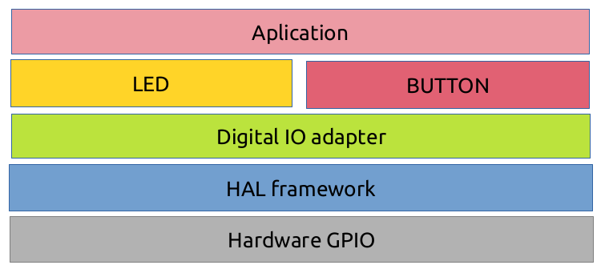
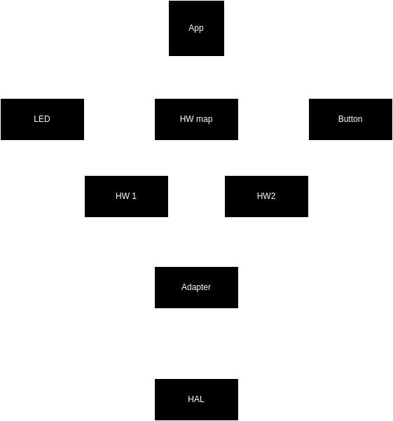

# arch_ex_button_led_stm32
# Application that Reads Buttons and Controls LEDs to Exemplify the Use of Decoupled Layered Architecture

## Introduction
In this application, we have two buttons and two LEDs connected to GPIO pins. The buttons' reading is performed periodically around every 10 ms. One button controls turning one of the LEDs on or off, while the other button, when pressed once, lights up the second LED. Pressing it twice turns off the LED; pressing it three times toggles the LED state every 100 ms, and pressing it four times turns off the toggle state of the LED.

For the implementation of this example, we used an STM32F103C6T6A MCU, BluePill hardware platform, STM32F1_HAL framework, C language, documentation in Doxygen style, and some adapted design patterns. Specifically, Facade, State, and an extremely simple state machine in the main application or main code. Adapters were built to encapsulate the low-level framework, GPIO drivers, or HAL (Hardware Abstraction Layer) so that the application becomes as independent as possible from the hardware platform used.

From these adapters, software components are built which abstract the buttons and LEDs into independent modules. The application utilizes these components and the hardware map that defines pins and ports to achieve the final firmware behavior.

The goal here is to demonstrate with something simple that it's possible to build a testable application, emulating object-oriented programming in C, and that works independently of the hardware. Allowing the use of mocks for testing the application (this part is not yet implemented).

## Architectural scheme 
The project has the following architecture:





The project file structure is as follows:
```shell
.
├── arch_ex_button_led_stm32
│   ├── Adpters
│   │   ├── digital_io_adapter.c
│   │   └── digital_io_adapter.h
│   ├── arch_ex_button_led_stm32 Debug.launch
│   ├── arch_ex_button_led_stm32.ioc
│   ├── Components
│   │   ├── Button
│   │   │   ├── button.c
│   │   │   └── button.h
│   │   └── Led
│   │       ├── led.c
│   │       └── led.h
│   ├── Core
│   │   ├── Inc
│   │   │   ├── hw_map.h
│   │   │   ├── main.h
│   │   │   ├── stm32f1xx_hal_conf.h
│   │   │   └── stm32f1xx_it.h
│   │   ├── Src
│   │   │   ├── main.c
│   │   │   ├── stm32f1xx_hal_msp.c
│   │   │   ├── stm32f1xx_it.c
│   │   │   ├── syscalls.c
│   │   │   ├── sysmem.c
│   │   │   └── system_stm32f1xx.c
│   │   └── Startup
│   │       └── startup_stm32f103c6tx.s
│   ├── Docs
│   ├── Drivers
└── README.md

```
Where:

- `Adapters`: adapters for the common interface of the used hardware.
- `Component/Button`: abstraction components for a button.
- `Component/Led`: software component for LED abstraction.
- `Core/Inc/hw_map.h`: hardware pin mapping.

To access the code documentation, go to the directory `Docs/html/index.html`.

## Conclusion
This project was write with STM32CubeIDE using HAL libraries and compiled with gcc.

As soon as possible tests and mocks will be add.

Feel free to copy, modify, and share this example.

Don't forget to mention the original source.

Created by: Rodrigo Pechoneri 2024.

[](https://www.youtube.com/watch?v=0CNXOXXDLmE)

Happy coding.
